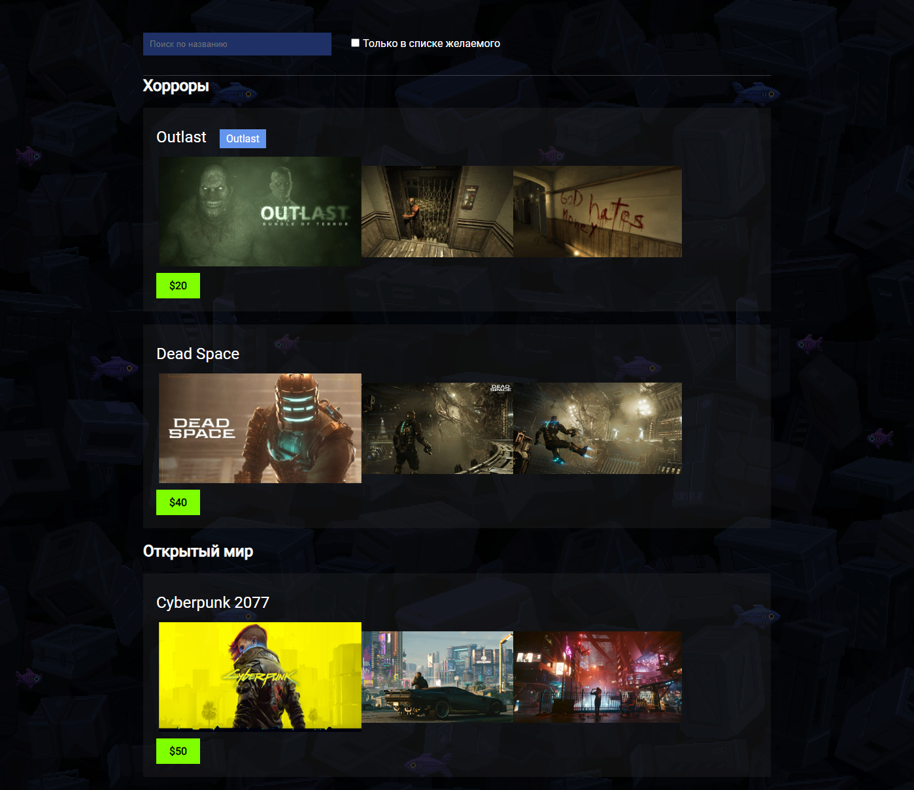

# Проект: Система фильтрации и поиска игр на React

<div align="center">
  
</div>

### >🛠 Технологии:

- React
- Sass
- Docker

### ⚙️ Описание:

В рамках этого проекта я отточил навыки модульного подхода к разработке, разбив приложение на независимые компоненты. Основной функционал включает:

- Фильтрация игр: пользователи могут фильтровать игры по категории "желанные".
- Поиск по названию: реализация быстрого и точного поиска игр по их названиям.

<br clear="both">

## Как запустить проект

В корне проекта запустить:

### `npm start`

## Dockerfile в проекте

В приложении есть dockerfile в котором приложение собирается и открывается с помощью сервера nginx.

Соберите `image` командой:
```
docker build -t <название контейнера которое вы хотите> .
```

### `docker build -t my-react-gamelist .`

После этой команды у вас будет образ(imgage) вашего приложения. \
Теперь этот собранный образ приложения можно запустить командой:
```
docker run -it <название контейнера коотрый хотите запустить
```

### `docker run -it my-react-gamelist`

Запустить приложение в режиме разработки.\
Откройте [http://localhost](http://localhost) чтобы увидеть приложение в браузере.
